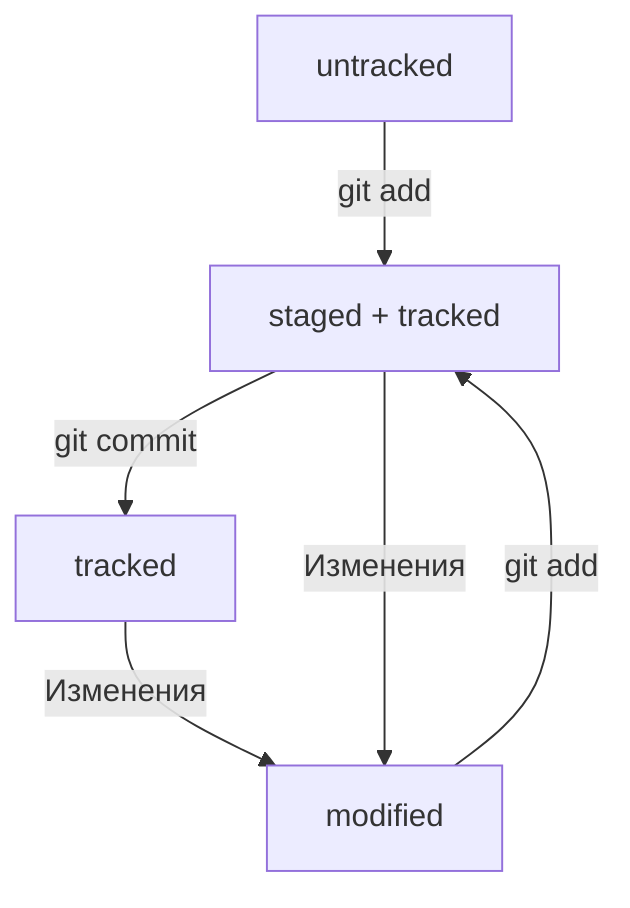

# Практическая работа №1. Шпаргалка на тему "Всё, что уже знаю!"

## 0. Пару слов про Git и GitHub.

Система контроля версий — это программное обеспечение, которое помогает отслеживать изменения в программах, 
текстовых файлах, больших документах, веб-сайтах и так далее. 

**Git** (_Global Information Tracker_) — наиболее распространенное в мире ПО среди систем контроля версий.
В качестве некоторых примеров использования Git подойдут:
- Синхронизация изменений файлов, созданных разными участниками команды
- Хранение истории изменений файлов при командной работе
- Хранение нескольких версий проекта, над которым работает один человек

**GitHub** — одна из популярных платформ для хранения IT-проектов и совместной работы над ними с использованием Git. 
По сути, это сайт, куда можно загрузить файлы своего проекта для обмена с другими людьми.

## 1. Приложение Git Bash. Основные команды.

В повседневной работе большинство пользователей Git используют консоли с наборами команд, похожие на те, 
что применяют в macOS и Linux. В случае использования ОС Windows необходимо установить специальный консольный
инструмент, который называется **Git Bash**. В нем используются все те же базовые команды.
Вот часть списка этих команд:
- `pwd` (_print working directory_) — выводит путь к текущей папке, 
- `ls` (_list directory contents_) — выводит содержимое текущей папки,
добавление флага `-a` приводит к выводу всех скрытых файлов и папок,
- `cd` (_change directory_) — выполняет переход в указанную папку,
- `touch` (_без комментариев_) — создает файл,
- `mkdir` (_make directory_) — создает папку,
добавление флага `-p` позволяет создать несколько папок, вложенных друг в друга,
- `cp` (_copy_) — копирует файлы(папки) из текущей папки в другую, в качестве аргументов передаются 
имя файла(папки) и путь для копирования,
- `mv` (_move_) — перемещает файлы(папки) из текущей папки в другую, в качестве аргументов передаются 
имя файла(папки) и путь для перемещения,
- `cat` (_concatenate and print_) — выводит содержимое файла в консоль, 
в качестве аргумента передается путь к файлу,
- `rm` (_remove_) — удаляет файл, в качестве аргумента передается путь к файлу,
добавление флага `-r` приводит к рекурсивному удалению всех файлов и подпапок с файлами,
- `rmdir` (_remove directory_) — удаляет пустую папку, в качестве аргумента передается путь к папке.

В примере указаны лишь единичные примеры флагов для команд. Чтобы узнать все флаги, введите в консоль:

```
"название команды" --help
```
В дальнейшем через приложение Git Bash будет выполнятся взаимодействие между пользователем 
и системой контроля версий (сам Git).

При работе с Git потребуется указать свои имя пользователя и электронную почту.
Это необходимо для того, чтобы в случае командной работы другим участникам было понятно, кто какие изменения вносил. 
Для этого требуется выполнить следующие команды с указанием персональных данных

```
git config --global user.name "User Userovich"
git config --global user.email user@userovich.by
```  

## 2. Создание локального репозитория. Выполнение коммита. Основные команды.

Чтобы Git начал отслеживать изменения в проекте, папку с файлами этого проекта нужно сделать Git-репозиторием
(далее - репозиторий). 
Для этого необходимо переместиться в папку с необходимым содержимым и выполнить команду `git init`.
При этом внутри появится служебная папка `.git`, хранящая всю необходимую информацию.
Для того, чтобы "разгитить" папку, необходимо перейти в нее и выполнить команду 

```
rm -rf .git
```

Для отслеживания изменений в репозитории используется команда `git status`.
Через нее можно определить, какие файлы участвуют или вовсе не участвуют в сохранении,
а также наличие изменений в файлах с предыдущего сохранения. 

Далее следует обозначить все измененные(новые) файлы и папки, которые необходимо сохранить.
Это выполняется при помощи команды 

```
git add "имя файла(папки)"
```
В случае обозначения всех имеющихся файлов(папок) в репозитории можно воспользоваться командами
`git add --all` или `git add .`.

Для контрольного сохранения обозначенных фалов используется команда 

```
git commit -m "комментарий"
```
Коммит гарантирует, что изменения будут сохранены в истории и при необходимости к ним можно будет «откатиться».
Комментрарий в коммите улучшает понимание и упрощает навигацию при дальнейшей работе.

Для просмотра истории коммитов используется команда `git log`.
При выводе истории для каждого выполненного коммита будет выводиться следующая информация:
- идентификатор коммита,
- данные пользователя, выполнившего коммит,
- дата и время выполнения коммита.

## 3. Генерация SSH-ключей. Создание удаленного репозитория. Основные команды.

Чтобы упростить работу с GitHub и сделать ее более безопасной, необходимо сгенерировать SSH-ключ.

**SSH** — наиболее распространенный сетевой криптопротокол, использующий в качестве ключа пару чисел 
(приватный и публичный ключи). Публичный ключ доступен всем и используется для шифрования данных.
Приватный ключ предназначен для расшифрования данных и хранится только у пользователя на компьютере.
Передавать кому-либо **приватный** ключ **категорически запрещено**!

По умолчанию директория с SSH-ключами находится в домашней директории пользователя.
Проверить их наличие можно с помощью команды 

```
ls -la ~/.ssh/
```
Данная команда выведет список содержимого папки `.ssh`, если такая существует.
Если есть файлы с похожими названиями, SSH-ключи уже создавались:
- `id_dsa.pub`
- `id_ecdsa.pub`
- `id_ed25519.pub`
- `id_rsa.pub`

Если вы не создавали эти файлы, удалите их все.

Для генерации SSH-ключа
- введите в Git Bash команду 

```
ssh-keygen -t ed25519 -C "электронная почта, к которой привязан ваш аккаунт на GitHub"
```
(если имеется сообщение об ошибке, то, скорее всего, система не поддерживает алгоритм шифрования `ed25519`,
альтернативным вариантом будет следующая строка) 

```
ssh-keygen -t rsa -b 4096 -C "электронная почта, к которой привязан ваш аккаунт на GitHub"
```
- укажите место хранения ключей (для сохранения в папку по умолчанию нажмите `Enter`).
- введите кодовую фразу для доступа к ключу (придется вводить потом ее каждый раз при установке соединения
с удаленным репозиторием, можно от нее отказаться, нажав `Enter`)
- убедитесь в создании ключевой пары через команду 

```
ls -a ~/.ssh 
```
(если вы сохраняли в папку не по умолчанию, вместо символа `~` введите путь к папке).

В случае успешной генерации появятся 2 файла. Один файл будет без расширения (приватный), 
другой - с расширением `.pub` (публичный).
Сохраните содержимое файла с расширением `.pub` (публичный ключ), оно потребуется далее.
**Не перепутайте** с **приватным** ключом при копировании!

Инструкция по созданию удаленного репозитория на GitHub:
- если вы не зарегистрированы, зарегистрируйтесь [на сайте](https://github.com "github.com"),
- зайдите в свой профиль по ссылке `https://github.com/username`, где `username` - имя,
которое вы указали при регистрации,
- создайте удаленный репозиторий, перейдя по вкладкам `Repositories → New`,
- в открывшемся окне создания нового репозитория введите его название,
оно не обязано совпадать с именем папки проекта у вас на компьютере,
- для создания удаленного репозитория нажмите `Create repository` внизу,
- выберите пункт `Settings` в меню аккаунта, в меню слева нажмите на пункт `SSH and GPG keys`, 
в открывшейся вкладке выберите `New SSH key`,
- в поле `Title` напишите название ключа, в поле `Key type` должно быть `Authentication Key`, 
в поле `Key` скопируйте ваш публичный ключ SSH, нажмите на кнопку `Add SSH key`,
- проверьте правильность ключа в Git Bash с помощью команды

```
ssh -T git@github.com
```

Если это первый раз, когда вы используете Git, чтобы поделиться проектом на GitHub, появится похожее предупреждение.

```
The authenticity of host 'github.com (140.82.121.4)' can't be established. 
ED25519 key fingerprint is SHA256:"некоторая последовательность символов"
This key is not known by any other names. Are you sure you want to continue connecting (yes/no/[fingerprint])?
```
Это предупреждение сообщает, что вы никогда не соединялись с сервером GitHub. 
Поэтому Git не может гарантировать, что сервер является тем, за кого он себя выдаёт.
Для подтверждения подлинности сервер генерирует и публикует ключи `SHA256`. 
Вы можете проверить ключи GitHub 
[по этой ссылке](https://docs.github.com/en/authentication/keeping-your-account-and-data-secure/githubs-ssh-key-fingerprints "Это ссылка ;)").
Если ключ в предупреждении совпадает с тем, что вы видите на сайте, значит, сервер является действительным. 
Введите `yes`, чтобы продолжить. Вы увидите приветствие на экране

```
Hi %ВАШ_АККАУНТ%! You've successfully authenticated, but GitHub does not provide shell access.
```

## 4. Синхронизация локального и удаленного репозиториев. Основные команды.

Для начала требуется связать репозитории.
Перейдите на страницу удалённого репозитория, выберите тип `SSH` (справа от типа `HTTPS`) и скопируйте `URL`.
Откройте консоль, перейдите в каталог локального репозитория и введите команду 

```
git remote add origin git@github.com:%ИМЯ_АККАУНТА%/%ИМЯ_ПРОЕКТА%.git
```
где `origin` — имя удаленного репозитория, а следующее за ним последовательность - скопированный `URL`. 
Осталось убедиться, что репозитории связаны. 
Сделать это можно с помощью следующей команды в приложении Git Bash:

```
git remote -v
```

В случае успеха вывод должен быть следующим:

```
git remote -v
origin    git@github.com:%ИМЯ_АККАУНТА%/%ИМЯ-ПРОЕКТА%.git (fetch)
origin    git@github.com:%ИМЯ_АККАУНТА%/%ИМЯ-ПРОЕКТА%.git (push)
```
Под синхронизацией понимается возможность загружать на (или скачивать из) удаленный репозиторий конкретный коммит.
Для загрузки изменений на удаленный репозиторий необходимо ввести команду 

```
git push
```
В первый раз эту команду нужно вызывать с дополнительными флагами и параметрами

```
git push -u origin main
```
Если произошла ошибка, замените `main` на `master`.
При взаимодействии с удалёнными репозиториями Git выводит в консоль отладочную информацию: 
количество объектов (файлов), которые отправляются на сервер, информацию о прогрессе сжатия и записи и так далее.
В дальнейшем при работе с удалённым репозиторием флаг `-u` можно опустить и писать просто `git push`.

Для понимания, каждый коммит сохраняет актуальное состояние файлов. Сами же коммиты хранятся в ветках.
Если коммит — это снимок состояния файлов, то ветка — временна́я шкала, на которой расположены эти снимки. 
Ветка всегда начинается от одного из коммитов.
В репозитории может существовать сразу несколько веток — параллельных историй изменений. 
Также они могут соединяться друг с другом.

## 5. Хеш как идентификатор коммита

**Хеширование** — это преобразование набора данных в числовую последовательность по заранее заданному правилу.

В случае хеширования коммитов под набором данных понимаются содержимое файлов в репозитории на момент коммита,
информация о пользователе, выполневшим коммит, дата и время его выполнения, 
а также ссылка на предыдущий или родительский коммит.
Git хеширует (преобразует) информацию о коммите с помощью алгоритма `SHA-1`, 
выходом которого является числовая последовательность, состоящая из 40 шестнадцатиричных символов.

Хеш фунция обязана удовлетворять следующим свойствам:
- если хеш получить дважды для одного и того же набора входных данных, то результат будет гарантированно одинаковый,
- если хоть что-то в исходных данных поменяется (хотя бы один символ), то хеш тоже изменится (причём сильно).

Git хранит таблицу соответствий `хеш → информация о коммите`. 
Если вы знаете хеш, вы можете узнать всё остальное: автора и дату коммита и содержимое закоммиченных файлов. 
Можно сказать, что хеш — основной идентификатор коммита.

При работе с Git хеши будут встречаться вам регулярно. 
Их можно будет передавать в качестве параметра разным Git-командам, чтобы указать, 
с каким коммитом нужно произвести то или иное действие.

Все хеши и таблицу `хеш → информация о коммите` Git сохраняет в служебные файлы. 
Они находятся в скрытой папке `.git` в репозитории проекта.

## 6. Описание коммита (лог)

После вызова `git log` повляется список коммитов. Разберемся в содержимом полученного вывода:

```
$ git log
commit 4b92453405b44b97c44d6ca277b77f2d5187814f (HEAD -> master, origin/master)	(1)
Author: Lavrov Vlad <lavrov_vlad11@mail.ru>					(2)
Date:   Thu Oct 31 22:38:33 2024 +0300						(3)

    Добавить главу: хеш как идентификатор коммита				(4)

```
- (1) — идентификатор коммита (значение хеш-функции),
- (2) — имя автора и его электронная почта,
- (3) — дата и время создания коммита,
- (4) — комментарий к коммиту.

Если репозиторий хранит в себе большое количество коммитов, 
можно воспользоваться сокращенным логом через команду `git log --oneline`.
После выхова команды в консоль запишется подобная информация:

```
$ git log --oneline
4b92453 (HEAD -> master, origin/master) Добавить главу: хеш как идентификатор коммита
7a1a058 Финальная версия
3868b6e Промежуточная редакция 3
e1a9434 Промежуточная редакция 2
731a479 Промежуточная редакция 1
32da5fc Шпаргалка первого практического задания
```
Сокращённый хеш (то есть первые несколько символов полного) можно использовать точно так же, как и полный. 
Для этого команда `git log --oneline` автоматически подбирает такую длину сокращённых хешей, 
чтобы они были уникальными в пределах репозитория и Git всегда мог понять, о каком коммите идёт речь.

## 7. Служебный файл HEAD

Файл `HEAD` — один из служебных файлов папки `.git`. 
Он указывает на коммит, который сделан последним (то есть на самый новый).
Внутри `HEAD` — ссылка на служебный файл с адресом `refs/heads/master` 
(или `refs/heads/main` в зависимости от названия ветки). 
Если заглянуть в этот файл, можно увидеть хеш последнего коммита.

При работе с Git указатель `HEAD` используется довольно часто. 
Многие команды Git принимают в качестве параметра хеш коммита. 
Если нужно передать последний коммит, то вместо его хеша можно просто написать слово `HEAD` — Git поймёт, 
что вы имели в виду последний коммит.

## 8. Статусы файлов в репозитории

Одна из ключевых задач Git — отслеживать изменения файлов в репозитории. 
Для этого каждый файл помечается каким-либо статусом. Рассмотрим основные.
- `untracked` (англ. «неотслеживаемый»). Новые файлы в Git-репозитории помечаются как `untracked`, 
то есть неотслеживаемые. Git «видит», что такой файл существует, но не следит за изменениями в нём. 
У `untracked`-файла нет предыдущих версий, зафиксированных в коммитах или через команду `git add`.
- `staged` (англ. «подготовленный»). После выполнения команды `git add` файл попадает в staging area 
(от англ. _stage_ — «сцена», «этап [процесса]» и _area_ — «область»), то есть в список файлов, 
которые войдут в коммит. В этот момент файл находится в состоянии `staged`.
`Staging area` также называют **index** (англ. «каталог») или **cache** (англ. «кеш»), 
а состояние файла `staged` иногда называют `indexed` или `cached`.
- `tracked` (англ. «отслеживаемый») — это противоположность `untracked`. 
Оно довольно широкое по смыслу: в него попадают файлы, которые уже были зафиксированы с помощью `git commit`, 
а также файлы, которые были добавлены в **staging area** командой `git add`. 
То есть все файлы, в которых Git так или иначе отслеживает изменения.
- `modified` (англ. «изменённый») — это состояние, которое присваивается файлу, 
когда Git сравнил его содержимое с последней сохранённой версией и нашёл отличия. 
Например, файл был закоммичен и после этого изменён.

Типичный жизненный цикл файла представлен на графе ниже.



Данный граф постоен при помощи формата [Mermaid](https://github.blog/developer-skills/github/include-diagrams-markdown-files-mermaid/). 

**Важный момент**, который **не удалось** указать на графе!
Если файл находится в состоянии `staged + tracked`, и в него вносятся изменения, 
то к нему **прибавляется** статус `modified`, остальнае статусы **сохраняются**. Далее возможно следующее:
- если вызвать команду `git add`, то статус `modified` удалится, а при коммите запишется новая версия этого файла,
- если вызвать команду `git commit`, то статусом будет только `tracked` и 
"закомитится" версия файла **до изменений**.

Определять статус файлов из репозитория позволяет уже знакомая нам команда `git status`.
Большинство файлов в типичном проекте будут находиться в состоянии `tracked` 
(то есть закоммичены и не изменены после коммита). 
Вы не увидите это состояние в выводе команды `git status` — 
иначе она бы каждый раз выводила список вообще всех файлов проекта.

В итоге 'git status' показывает только следующие состояния файлов:
- `staged` (`Changes to be committed` в выводе `git status`),
- `modified` (`Changes not staged for commit`),
- `untracked` (`Untracked files`).

Типичные варианты вывода `git status`:
- нет ни `staged`-, ни `modified`-, ни `untracked`-файлов — в репозитории нет новых или измененных файлов,
выводом будет

```
$ git status
On branch master
nothing to commit, working tree clean  
```

- найдены 'untracked'-файлы — есть файлы, не добавленные в репозиторий через `git add`, в выводе появится

```
$ touch fileA.txt
$ git status
On branch master
Untracked files:
  (use "git add <file>..." to include in what will be committed)
        fileA.txt

nothing added to commit but untracked files present (use "git add" to track)
```  

- найдены `modified`-файлы — имеются измененные файлы, которые ещё не добавлены в staging area после этого,
вывод будет иметь вид

```
$ git status 
On branch master
Changes not staged for commit: # ещё одна секция
  (use "git add <file>..." to update what will be committed)
  (use "git restore <file>..." to discard changes in working directory)
        modified:   fileA.txt
```

- файл добавлен в staging area, но после этого изменен — наиболее интересный случай, 
описанный ранее в **важном моменте**. Конкретный пример такого случая:

```
$ git status
On branch master
Changes to be committed:
  (use "git restore --staged <file>..." to unstage)
          modified:   fileA.txt

Changes not staged for commit:
  (use "git add <file>..." to update what will be committed)
  (use "git restore <file>..." to discard changes in working directory)
          modified:   fileA.txt
```

Этот случай описывался ранее. Чтобы закоммитить самую свежую версию файла, 
нужно снова выполнить `git add` перед коммитом.

## 9. Оформление сообщений к коммитам

Сообщения коммитов можно сравнить с надписями на коробках в кладовке. 
Если надписей нет, то нужную коробку будет сложно найти: придётся заглянуть в каждую, чтобы понять, что там. 
А если надписи есть, то нужная найдётся сразу.
Как и надпись на коробке, сообщение коммита должно помочь определить, что внутри. 
Есть общие рекомендации по тому, как правильно составить сообщение. Оно должно быть:
- относительно коротким, чтобы его можно было легко прочитать,
- достаточно информативным,
- все сообщения оформлены в одном стиле.

Существуют различные стили оформления. Перечислим далее некоторые из них. 
В **корпоративном** стиле в начале сообщения обычно указывают Jira-ID 
(Jira - система для организации проектов и задач), а после — текст сообщения.
Например,

```
git commit -m "LGS-239: Дополнить список пасхалок новыми числами"
```
Стандарт **Conventional Commits** (англ. «соглашение о коммитах») отличается качественной документацией 
и подробной проработкой. Он подходит для репозиториев с исходным кодом программ и предлагает формат коммита
`<type>: <сообщение>`. Первая часть `type` — это тип изменений. Таких типов достаточно много. Вот два примера:
- `feat`(сокращение от англ. _feature_) — для новой функциональности,
- `fix` (от англ. «исправить», «устранить») — для исправленных ошибок.

Более подробный список можно увидеть [на сайте с описанием этого стиля](https://www.conventionalcommits.org/ru/v1.0.0-beta.4/#%D1%81%D0%BF%D0%B5%D1%86%D0%B8%D1%84%D0%B8%D0%BA%D0%B0%D1%86%D0%B8%D1%8F)
Например, сообщение может быть таким.

```
git commit -m "feat: добавить подсчёт суммы заказов за неделю"
```

GitHub можно использовать не только для хранения файлов проекта, 
но и для ведения списка задач (англ. _issue_) этого проекта. 
Если коммит «закрывает» или «решает» какую-то задачу, то в его сообщении удобно указывать ссылку на неё. 
Для этого в любом месте сообщения нужно указать `#<номер задачи>`. Например, вот так.

```
git commit -m "Исправить #334, добавить график температуры" 
```
В таком случае GitHub свяжет коммит и задачу.


Спасибо, что дочитали конспект до конца!

С уважением, headshotered =)

Meow!